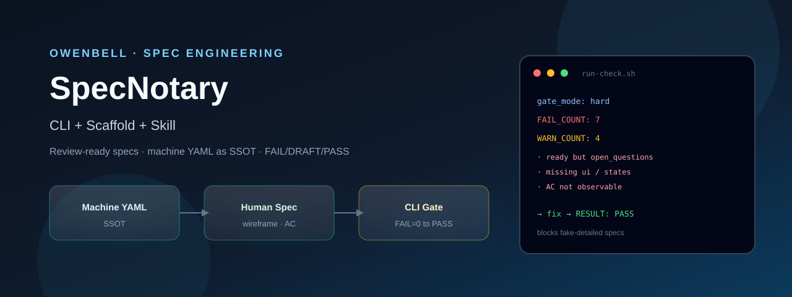
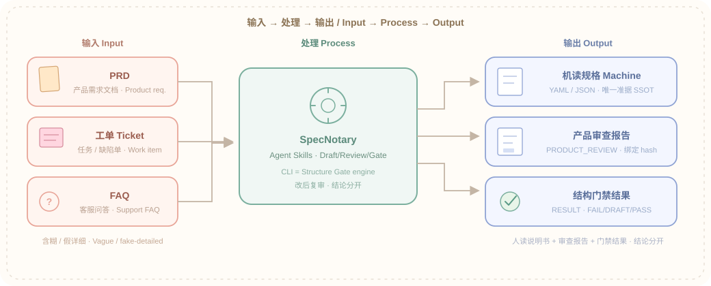
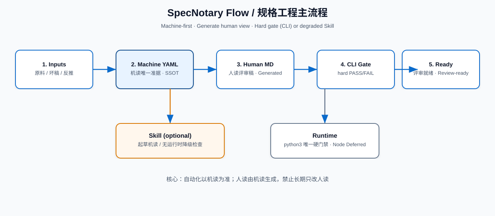
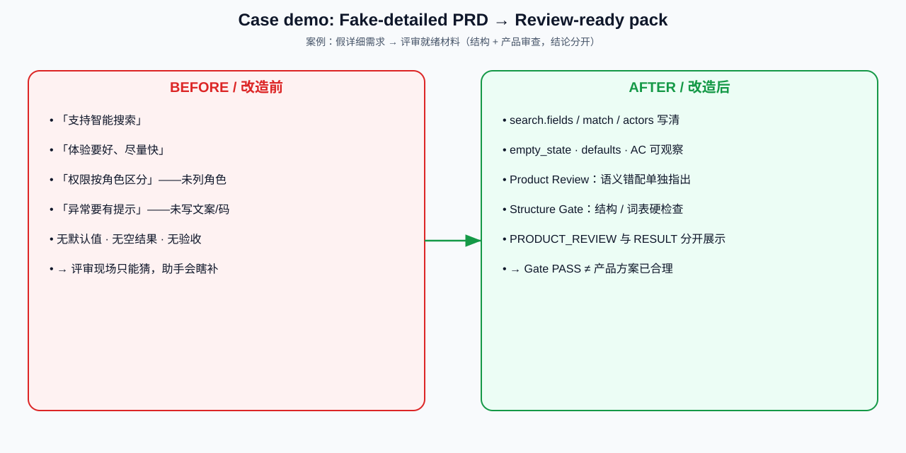
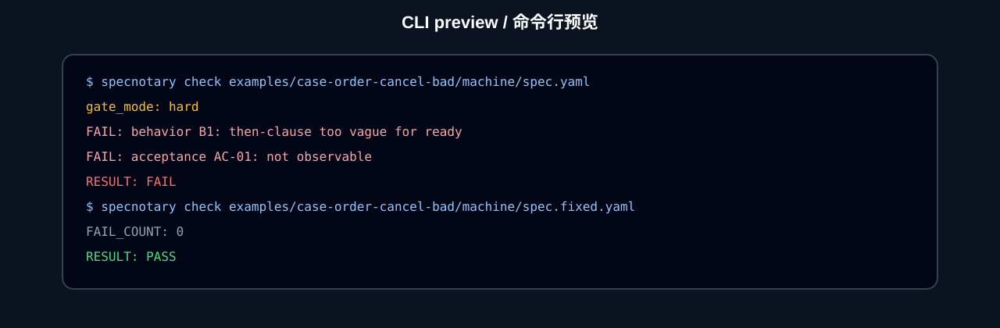
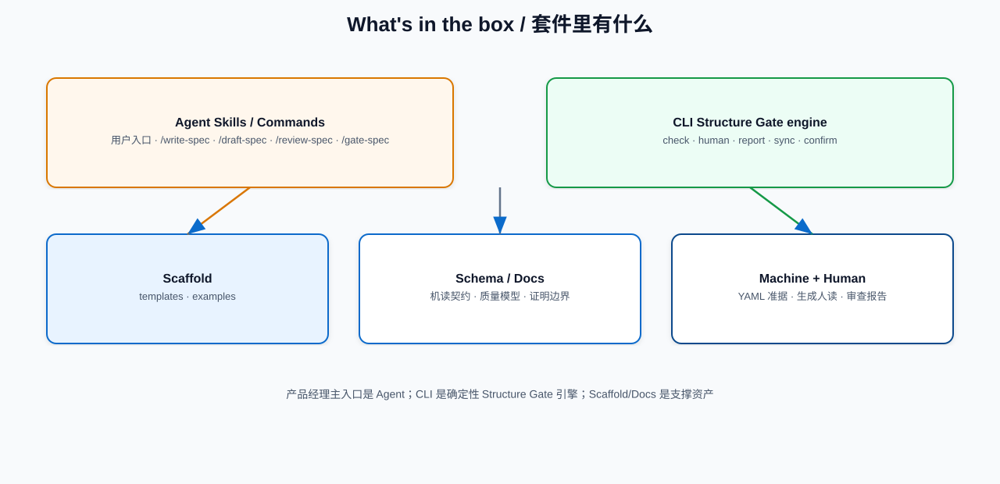

<p align="center">
  
</p>

<h1 align="center">Spec Kit</h1>

<p align="center">
  <strong>CLI 工具包 + 模板脚手架</strong>（辅：Cursor Skill）<br/>
  产出：<strong>可开发的需求规格说明书</strong><br/>
  机读 YAML 为准据 · 人读施工图 · CLI 门禁（FAIL / WARN / Pending）
</p>

<p align="center">
  <a href="#value">Value</a> ·
  <a href="#overview">Overview</a> ·
  <a href="#demo">Demo</a> ·
  <a href="#quick-start">Quick Start</a> ·
  <a href="#gates">Gates</a> ·
  <a href="#examples">Examples</a> ·
  <a href="#structure">Structure</a> ·
  <a href="#docs">Docs</a>
</p>

<p align="center">
  
  
  
  
</p>

---

<a id="value"></a>

## Value · 解决什么问题

**一句话：** 把含糊的 PRD / 工单 / FAQ，压成研发能按表开工、测试能按验收标准（AC）验收的规格；口号式「假详细」会被 CLI 拦下。

| 痛点 | Spec Kit 怎么处理 |
|------|-------------------|
| 需求写了很长，研发仍要猜显隐、文案、默认值 | 人读视图强制线框 · 控件表 · 状态矩阵 · 编号主路径 |
| 「智能 / 尽快 / 体验好」冒充可开发 | 硬门禁 `FAIL`：空话 then / 不可观察 AC 直接否决 |
| 人读与机读各改各的，越改越漂 | **以机读 YAML 为唯一准据**（行业常说 single source of truth）；人读只由生成器产出 |
| 未决事项假装已就绪 | `Pending` 须齐四要素；挂在 `ready` 上 → `FAIL` |
| 没装 Python/Node 就没法干活 | 可用 Skill 降级检查，但必须标 `gate_mode: degraded`，不得冒充硬门禁 |

<p align="center">
  
</p>

### 谁用 · 什么时候用

| 场景 | 做什么 |
|------|--------|
| 产品 / BA 收口需求 | 从原料起草机读 YAML，跑门禁，再生成人读施工图给研发 |
| 研发开工前 | 用控件表与状态矩阵对齐「能不能做、做到哪」 |
| 测试写用例前 | 用 AC 与空态文案当验收输入 |
| Agent / Skill 协作 | 让 Agent 改机读而不是空改 Markdown；CLI 当机器验收 |
| 复盘假详细稿 | 对照 `case-order-cancel-bad`：看哪些规则会打死坏稿 |

**不是什么：** 不是又一份口号式 PRD 模板，也不是完整商业 PRD 替代品。上游 PRD 仍是**原料**；Spec Kit 的正式产出名是**可开发的需求规格说明书**。

---

<a id="overview"></a>

## Overview · 工具长什么样

**载体（最终态）：**

| 层 | 是什么 | 职责 |
|----|--------|------|
| **CLI**（主） | `./cli/run-check.sh` · `./cli/run-generate-human.sh` | 硬门禁；机读 → 人读 |
| **Scaffold**（主） | `templates/` · `examples/` | 字段体例与施工图级样例 |
| **Skill**（辅） | `skills/` | 起草机读；无运行时的降级检查 |

<p align="center">
  
</p>

**能力一览**

| Capability | 白话 |
|------------|------|
| Machine-first | 改 YAML/JSON；人读 Markdown 由 CLI 生成，禁止长期手改漂移 |
| Construction-grade human | 线框 · 控件表 · 状态矩阵 · 编号主路径 · AC · Pending |
| Hard CLI gate | `FAIL_COUNT` 必须为 0 才 PASS；`WARN` 暴露质量债 |
| Dual runtime | `python3` 或 `node`（`cli/node` 需先 `npm i`） |
| Degraded Skill | 无运行时可用，但结果必须标 `degraded` |

---

<a id="demo"></a>

## Demo · 用真规格说话

<p align="center">
  
</p>

打开「电商未发货取消」人读视图的一截——有线框、控件显隐、失败文案原文。  
留人不靠空口号，靠**你能否按这张表开发**。

### 摘录 · 控件规格

| 控件 | 文案 | 显示条件 | 失败反馈 |
|------|------|----------|----------|
| `btn_cancel` | 取消订单 | 买家本人且状态∈{unpaid,paid_unshipped}且风控未拦截 | — |
| `btn_cancel_disabled` | 取消订单（置灰） | 状态∈{fulfilling,shipped} | 当前订单状态不支持自助取消，请联系客服或去售后中心 |
| `dlg_confirm_ok` | 确认取消 | 弹窗打开 | 取消失败，请稍后重试（网络/支付通道异常时） |

### 摘录 · 状态矩阵

| 状态 | 买家自助取消 | 说明 |
|------|--------------|------|
| `unpaid` | 允许 | 关单、释券、无退款单 |
| `paid_unshipped` | 允许 | 原路退款+回库；不自动回券 |
| `fulfilling` / `shipped` | 禁止 | `not_allowed` 原文提示 |

完整样例：

- 机读 → [`examples/case-order-cancel-raw/machine/spec.yaml`](examples/case-order-cancel-raw/machine/spec.yaml)
- 人读 → [`examples/case-order-cancel-raw/human/spec.md`](examples/case-order-cancel-raw/human/spec.md)

---

<a id="quick-start"></a>

## Quick Start

**前置：** `python3`（推荐）或 `node`（`cd cli/node && npm i`）

```bash
cd spec-kit

# 1) 硬门禁 — FAIL 必须清零
./cli/run-check.sh examples/case-order-cancel-raw/machine/spec.yaml

# 2) 看假详细如何被拦下
./cli/run-check.sh examples/case-order-cancel-bad/machine/spec.yaml

# 3) 机读 → 人读施工图
./cli/run-generate-human.sh \
  examples/case-order-cancel-raw/machine/spec.yaml \
  examples/case-order-cancel-raw/human/spec.md

# 4) 回归
python3 tests/test_cli.py
```

> [!NOTE]
> 无 Python/Node：用 `skills/` 做降级检查，结果必须写明 `gate_mode: degraded`，不得冒充硬门禁。

---

<a id="gates"></a>

## Gates

<p align="center">
  
</p>

<p align="center">
  
</p>

| 层 | 含义 | 对 RESULT 的影响 |
|----|------|------------------|
| **FAIL** | 硬阻塞（空话 AC、缺 ui/states、ready 挂未决…） | 任意 1 条 → **FAIL** |
| **WARN** | 质量债（缺 empty_states、缺 step_id…） | 单独不否决；建议清零 |
| **Pending** | 未决项须含：问题 / 负责人 / 截止 / 阻塞什么 | 挂在 `ready` 上 → **FAIL** |

详解：[`docs/gate-modes.md`](docs/gate-modes.md)

---

<a id="examples"></a>

## Examples

同一业务主题：**电商 · 未发货自助取消**（虚构脱敏）

| 案例 | 输入 | 门禁 | 跳转 |
|------|------|------|------|
| Order cancel · raw | 运营约束清单 | PASS | [打开](examples/case-order-cancel-raw/) |
| Order cancel · bad | 假详细 PRD → 修好稿 | FAIL → PASS | [打开](examples/case-order-cancel-bad/) |
| Order cancel · FAQ | 客服 FAQ 反推 | PASS | [打开](examples/case-order-cancel-ops-faq/) |

坏稿会被哪些规则打死（示例）：缺 `ui` / `states` / `actors`、then 含「智能/尽快/体验好」、AC 不可观察、`ready` 仍留 `open_questions`。

更多说明：[`examples/README.md`](examples/README.md)

---

<a id="structure"></a>

## Structure

<p align="center">
  
</p>

| 路径 | 作用 |
|------|------|
| [`cli/`](cli/) | 硬门禁与人读生成（主入口） |
| [`templates/machine`](templates/machine) · [`templates/human`](templates/human) | 机读字段体例 · 人读体例 |
| [`examples/`](examples/) | 施工图级样例 |
| [`skills/`](skills/) | 辅：起草与降级 |
| [`docs/what-is-dev-ready.md`](docs/what-is-dev-ready.md) | 「可开发」定义 |

**产物分工**

| 产物 | 定位 |
|------|------|
| 机读 YAML/JSON | **唯一准据**（改这里） |
| 人读 Markdown | 同一规格的说明书 / 施工图视图（由 CLI 生成） |
| 上游 PRD / 工单 / FAQ | **原料**，不是 Spec Kit 的正式产出名 |

**纪律：** 外部 PRD 脚手架仅作只读灵感；业务母版不写入本工具目录。

---

<a id="docs"></a>

## Documentation

| Doc | 内容 |
|-----|------|
| [`docs/what-is-dev-ready.md`](docs/what-is-dev-ready.md) | 什么叫「可开发」 |
| [`docs/gate-modes.md`](docs/gate-modes.md) | hard / degraded 门禁模式 |
| [`docs/skill-boundary.md`](docs/skill-boundary.md) | CLI 与 Skill 边界 |
| [`examples/README.md`](examples/README.md) | 案例索引 |
| [`skills/SKILL.md`](skills/SKILL.md) | Skill 规则 |

---

## Status

OwenBell · Spec Kit 本地建设中 · 上传 GitHub 前走九步复核（**上传即公开**）
