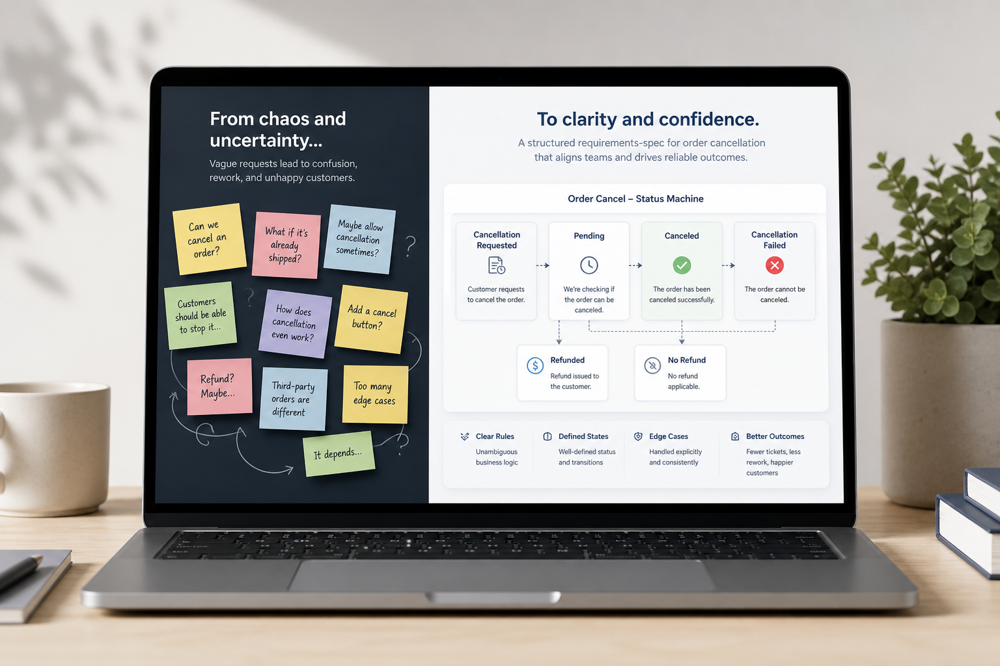
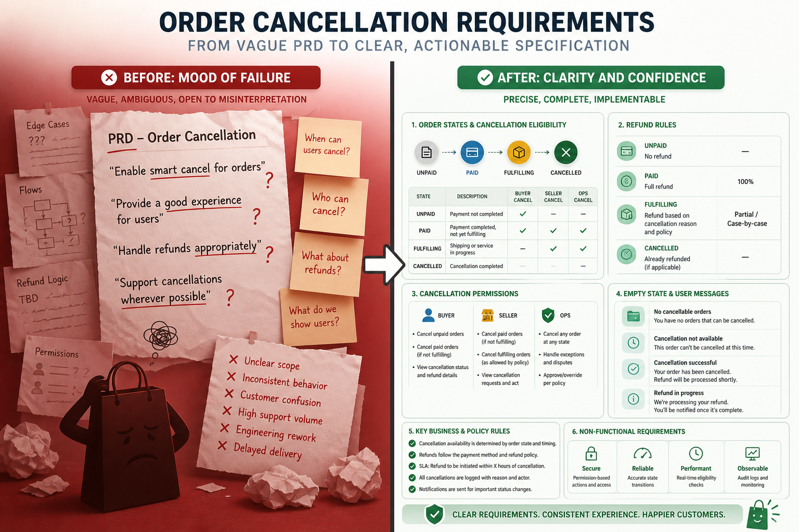
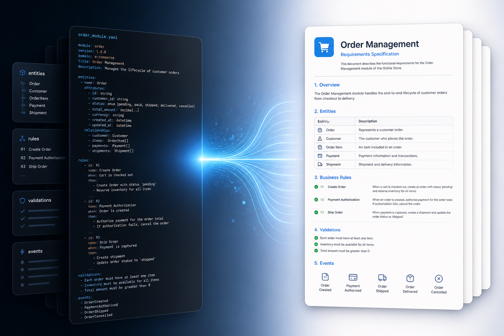

# Spec Kit

**可开发的需求规格说明书** 工具包 — machine-first · human-readable · CLI-gated  
by **OwenBell**

[](#)
[](#)
[](#)

<p align="center">
  
</p>

### 一句话卖点

> 别再让研发靠猜。把「取消订单要智能一点」这种假详细，变成**状态、权限、退款 SLA、库存回库**都写死的  
> **可开发的需求规格说明书**（机读主源 + 人读说明书 + 本地硬门禁）。

英文同义：**Dev-ready Requirements Specification** — not another fluffy PRD template pack.

---

## 这是给谁的 / Who it's for

| 你是… | 你会得到… |
|--------|-----------|
| ToB / 电商 / 交易域产品 | 能直接丢给研发开干的取消/履约类规格骨架 |
| 用 Cursor / Agent 写需求的人 | 机读 YAML 当唯一真相，减少模型瞎补业务规则 |
| 讨厌返工的人 | `PASS/FAIL` 门禁：缺角色、缺默认值、空话 then → 直接红灯 |

**不是什么：** 完整商业 PRD 百科（背景故事、GTM、融资叙事这里不主攻）。上游 PRD/工单/FAQ 当**原料**；本仓库产出的是**规格层**。

---

## 先看效果：电商「未发货取消」

真实团队天天吵的模块。我们用**虚构自营商城**跑通三条路径：原料 → 假详细被拦 → FAQ 反推。

<p align="center">
  
</p>

### 假详细 vs 可开发（同一功能）

| | 假详细（会 FAIL） | 可开发规格（会 PASS） |
|--|------------------|----------------------|
| 状态 | 「能取消就取消」 | `unpaid` / `paid_unshipped` 可自助；`fulfilling`/`shipped` 禁止 |
| 退款 | 「尽快退款」 | 原路退回；**2 小时内**进度可查 |
| 库存 | 「要正确」 | 取消成功 **立即回库** |
| 券 | 没写 | 待支付取消释放锁券；已支付取消**不自动回券** |
| 风控 | 没写 | 命中风控 → 禁止自助 + 固定文案 |
| 验收 | 「体验好」 | Given/When/Then 对到状态与退款单 |

<p align="center">
  
</p>

**机读是合同，人读是说明书。** 改规则只改 YAML，再生成 Markdown——禁止两套长期分叉。

---

## 30 秒上手

```bash
cd spec-kit

# 硬门禁：修好的订单取消规格
./cli/run-check.sh examples/case-order-cancel-raw/machine/spec.yaml
# → RESULT: PASS

# 假详细：看门禁怎么红灯
./cli/run-check.sh examples/case-order-cancel-bad/machine/spec.yaml
# → RESULT: FAIL

# 生成人读《可开发的需求规格说明书》视图
./cli/run-generate-human.sh examples/case-order-cancel-raw/machine/spec.yaml \
  examples/case-order-cancel-raw/human/spec.md

python3 tests/test_cli.py
```

Node 跑 YAML：`cd cli/node && npm i`  
没有运行时：用 `skills/` **降级**（必须标 `degraded`，不能冒充硬门禁）。

---

## 案例库（电商订单取消）

### Case A — 运营诉求原料 → PASS

从「客服被取消工单淹没」的约束清单，落到状态机与退款 SLA。

- 原料：[`examples/case-order-cancel-raw/input/ops-request.zh.txt`](examples/case-order-cancel-raw/input/ops-request.zh.txt)
- 机读：[`examples/case-order-cancel-raw/machine/spec.yaml`](examples/case-order-cancel-raw/machine/spec.yaml)

### Case B — 假详细 PRD → FAIL → 修好 PASS

- 坏稿：[`examples/case-order-cancel-bad/input/bad-prd.zh.md`](examples/case-order-cancel-bad/input/bad-prd.zh.md)
- FAIL 机读：[`.../machine/spec.yaml`](examples/case-order-cancel-bad/machine/spec.yaml)
- PASS 机读：[`.../machine/spec.fixed.yaml`](examples/case-order-cancel-bad/machine/spec.fixed.yaml)

### Case C — 客服 FAQ 事后反推

把「为什么点不了取消 / 钱何时回来」收成同一套规格字段（含已支付取消不回券）。

- FAQ：[`examples/case-order-cancel-ops-faq/input/cs-faq.zh.txt`](examples/case-order-cancel-ops-faq/input/cs-faq.zh.txt)
- 机读：[`examples/case-order-cancel-ops-faq/machine/spec.yaml`](examples/case-order-cancel-ops-faq/machine/spec.yaml)

---

## 你带走的能力

1. **可开发的需求规格说明书**双语骨架（机读 YAML 优先，人读 MD 生成）  
2. **硬门禁 CLI**（Python / Node 自适应）  
3. **电商级示例**而不是玩具待办 / 书架 demo  
4. **Skill 辅线**：起草与无运行时降级  

原则速查：[`docs/what-is-dev-ready.md`](docs/what-is-dev-ready.md) · [`docs/gate-modes.md`](docs/gate-modes.md) · [`docs/skill-boundary.md`](docs/skill-boundary.md)

---

## 定位一句话（避免误会）

| 产物 | 定位 |
|------|------|
| 机读 YAML/JSON | 可开发需求规格的**主源 / 合同** |
| 人读 Markdown | 同一规格的**说明书视图**（给评审与研发阅读） |
| 上游 PRD / 工单 / FAQ | **输入原料**，不是本工具的主产出名 |

---

## 状态

本地建设中。示例为虚构电商，已脱敏。  
HiDream 内网文生图服务若不可用，主页配图使用备用高质量生成图。  

**OwenBell** · Spec Kit · 上传 GitHub 前仍须九步复核（上传即公开）。
