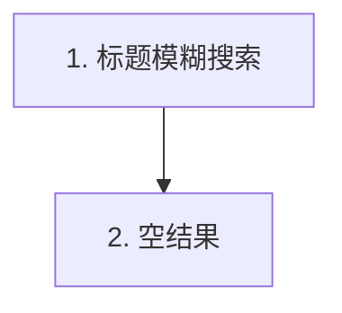

<!-- generated_from: examples/case-list-search/machine/spec.yaml -->
<!-- spec_id: SPEC-LIST-SEARCH-001 -->
<!-- spec_version: 0.1 -->
<!-- spec_hash: 7af9b6454b4b33d735e23adc27b37fbbc44ce0757c54f7c28b2a747ee55808c1 -->
<!-- body_hash: e54452daba1855f8fd38326bc782c9188c7d343f944eaffa6d86da1547d95cde -->
<!-- renderer_version: 3 -->
<!-- gate_mode: hard -->
<!-- 以机读 YAML 为唯一准据；禁止长期只改本文件 -->
# 商品列表 · 标题/ID 搜索

> **文档类型**：可开发的需求规格说明书（人读视图）  
> **规格 ID**：`SPEC-LIST-SEARCH-001` · **状态**：`ready` · **版本**：`0.1`  
> **机读哈希**：`7af9b6454b4b33d7…`

**EN title:** Product list · Title/ID search

## 目录

- [1. 概览](#1-概览)
- [2. 范围](#2-范围)
- [3. 角色与权限](#3-角色与权限)
- [4. 状态与允许动作](#4-状态与允许动作)
- [5. 页面与交互](#5-页面与交互)
- [6. 主路径（编号）](#6-主路径编号)
- [7. 默认值与提示文案](#7-默认值与提示文案)
- [8. 验收标准（AC）](#8-验收标准ac)
- [9. 信息待闭合项（Pending）](#9-信息待闭合项pending)
- [10. 对象 AI](#10-对象-ai)
- [11. 原料覆盖（SourceClaim）](#11-原料覆盖sourceclaim)

## 1. 概览

商城后台商品列表新增标题模糊 / ID 精确搜索：默认每页 20 条、按更新时间倒序，空结果与超长关键词均有固定文案。不做语义检索。

**设计原则：**

1. 匹配模式与分页参数全部落 defaults，不留口头约定
2. 空态文案原文入库，界面逐字使用

## 2. 范围

**本期做：**

- 按商品标题模糊匹配
- 按商品 ID 精确匹配
- 空结果展示固定文案

**本期不做（白名单外，不展开）：**

- 语义检索、同义词扩展、跨店聚合

**对照基线：** 虚构自营商城后台商品列表（不含向量检索）

## 3. 角色与权限

2 类角色；可执行动作与状态矩阵联动。

| 角色 | 说明 | 可执行动作 |
|------|------|------------|
| `merchant_ops` | 商家运营 | search_own_products |
| `platform_admin` | 平台管理员 | search_all_products |

## 4. 状态与允许动作

4 个状态 × 1 类动作，其中明确禁止 1 项。前端显隐与置灰以下表为唯一准据。

生命周期顺序（示意）：


**生命周期（编号供流程对照）：**
1. `idle`
2. `searching`
3. `results`
4. `empty`

| 状态 | 动作 | 是否允许 | 说明 |
|------|------|----------|------|
| `idle` | `submit_search` | 允许 | 可提交关键词 |
| `searching` | `submit_search` | 禁止 | 请求进行中，按钮置灰 |
| `results` | `submit_search` | 允许 | 可再次搜索 |
| `empty` | `submit_search` | 允许 | 可修改关键词重试 |

## 5. 页面与交互

**入口：** 商品列表页顶部搜索栏

### 线框

```text
┌─ 商品列表 ────────────────────────────┐
│ [关键词________] [搜索]               │
│ 结果表… / 空态文案                    │
└───────────────────────────────────────┘
```

### 控件规格

共 2 个控件，其中 1 个定义了失败反馈文案。

| 控件 | 文案/占位 | 显示条件 | 交互 | 失败反馈 |
|------|-----------|----------|------|----------|
| inp_keyword | 请输入标题或商品 ID | 始终 | 输入 | — |
| btn_search | 搜索 | 始终；searching 时置灰 | 提交搜索 | 搜索失败，请稍后重试 |

## 6. 主路径（编号）

共 2 步；每步的 Given/When/Then 同时是测试的验收输入。



### 步骤 1 · 标题模糊搜索

- **Given：** 运营在商品列表页，列表有数据
- **When：** 输入标题片段并点击搜索
- **Then：** 返回标题包含关键词的商品，按更新时间倒序，每页 20 条

### 步骤 2 · 空结果

- **Given：** 关键词无匹配
- **When：** 点击搜索
- **Then：** 列表为空，展示文案「无匹配商品，请调整关键词」

## 7. 默认值与提示文案

### 默认值

| 项 | 值 |
|----|----|
| `page_size` | `20` |
| `match_mode` | `fuzzy_title_or_exact_id` |
| `max_keyword_len` | `64` |

### 空态 / 拦截文案（须与界面一致）

| 场景 | 文案 |
|------|------|
| `no_match` | 无匹配商品，请调整关键词 |
| `keyword_too_long` | 关键词最长 64 字 |

## 8. 验收标准（AC）

共 2 条；逐条可执行，不可观察的表述会被门禁否决。

- **AC-01**（行为 `B1`）：输入「蓝牙」可看到标题含「蓝牙」的商品行
- **AC-02**（行为 `B2`）：输入不存在关键词时页面展示固定空态文案

## 9. 信息待闭合项（Pending）

无。

## 10. 对象 AI

- enabled: `False`

## 11. 原料覆盖（SourceClaim）

覆盖账本（附录）：原料每句话的下落。covered 2 · assumption 1 · out_of_scope 1 · 其他 0。

| ID | 处置 | 摘要 | 规格引用 |
|----|------|------|----------|
| `SRC-CLM-LS-01` | `covered` | 按标题模糊搜、按商品 ID 精确搜 | `B1`, `AC-01`, `inp_keyword`, `btn_search` |
| `SRC-CLM-LS-02` | `covered` | 无匹配时展示固定空态文案 | `B2`, `AC-02` |
| `SRC-CLM-LS-03` | `out_of_scope` | 不做语义检索 | — |
| `SRC-CLM-LS-04` | `assumption` | 默认每页 20 条（原料未写死，产品补默认） | `defaults.page_size` |
