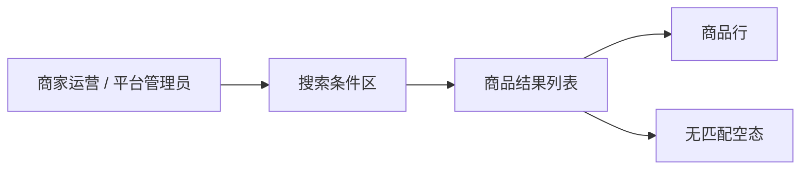
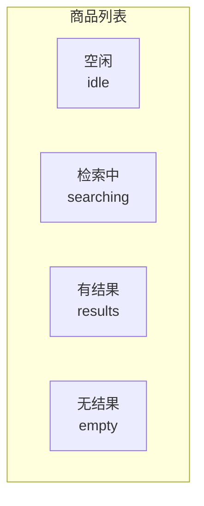

# 商品列表 · 标题/ID 搜索

> **文档类型**：评审就绪的标准需求规格说明书（人读评审稿）<br>
> **规格编号**：`SPEC-LIST-SEARCH-001` · **进度**：已定稿，结构已过关，可以开会（`ready`） · **版本**：`0.1`  
> **机读哈希**：`21c5f12a957ffc20…`<br>
> **怎么读：** 先看「功能说明」判断本期方案；「主路径」用 Given/When/Then 逐条核对结果；「状态与允许动作」说明按钮何时可点；「页面与交互」说明按钮文案和失败提示。

**EN title:** Product list · Title/ID search

## 目录

- [1. 概览](#1-概览)
- [2. 范围](#2-范围)
- [3. 功能说明](#3-功能说明)
- [4. 产品与信息架构](#4-产品与信息架构)
- [5. 职责边界](#5-职责边界)
- [6. 数据契约](#6-数据契约)
- [7. 角色与权限](#7-角色与权限)
- [8. 状态与允许动作](#8-状态与允许动作)
- [9. 页面与交互](#9-页面与交互)
- [10. 主路径（编号）](#10-主路径编号)
- [11. 默认值与提示文案](#11-默认值与提示文案)
- [12. 错误码](#12-错误码)
- [13. 验收标准（AC）](#13-验收标准ac)
- [14. 信息待闭合项（Pending）](#14-信息待闭合项pending)
- [15. 决策记录](#15-决策记录)
- [16. 对象 AI](#16-对象-ai)
- [17. 原料落在规格里的情况](#17-原料落在规格里的情况)

## 1. 概览

商城后台商品列表新增标题模糊 / ID 精确搜索：默认每页 20 条、按更新时间倒序，空结果与超长关键词均有固定文案。不做语义检索。

**设计原则：**

1. 匹配模式与分页参数全部落 defaults，不留口头约定
2. 空态文案原文入库，界面逐字使用

## 2. 范围

**本期做：**

- 按商品标题模糊匹配
- 按商品 ID 精确匹配
- 空结果展示固定文案

**本期不做（白名单外，不展开）：**

- 语义检索、同义词扩展、跨店聚合

**对照基线：** 虚构自营商城后台商品列表（不含向量检索）

## 3. 功能说明

本章列出本期要做的功能。每条的验收写法（Given/When/Then）见后面「主路径」同编号步骤。

### 1. 标题模糊搜索

**要做到：** 返回标题包含关键词的商品，按更新时间倒序，每页 20 条
**对应：** 步骤 1 · `B1`

### 2. 空结果

**要做到：** 列表为空，展示文案「无匹配商品，请调整关键词」
**对应：** 步骤 2 · `B2`

### 3. 商品 ID 精确匹配

**要做到：** 仅返回该 ID 对应的一行商品；ID 不存在则走空结果分支
**对应：** 步骤 3 · `B3`

## 4. 产品与信息架构

商品列表页由搜索条件、结果列表、商品行和空态组成；本图只描述产品页面与信息对象，不表示技术调用关系。



## 5. 职责边界

本章按模块划分方案边界。每个模块先写中文名称；括号里的机读 ID 给助手和检查工具对账，不是菜单原文。「负责」是该模块包含的界面或能力，「不负责」是明确不做的事。

### 搜索条件区

这是**模块**（机读 ID：`search_area`）。

| 负责 | 不负责 |
|------|--------|
| 接收标题片段或完整商品 ID | 语义检索、同义词扩展 |
| 展示输入长度限制与搜索中状态 | — |

### 商品结果区

这是**模块**（机读 ID：`result_area`）。

| 负责 | 不负责 |
|------|--------|
| 展示匹配商品、排序与分页结果 | 商品编辑与批量操作 |
| 展示无匹配和搜索失败文案 | — |

## 6. 数据契约

共 2 个数据实体。每个对象一张字段表，用于评审时对齐业务含义、输入输出和关键规则；不在这里规定开发语言或测试方案。

### SearchCondition · 商品搜索条件

| 字段 | 中文 | 类型 | 说明 |
|------|------|------|------|
| `keyword` | 搜索关键词 | `string` | 标题片段或完整商品 ID，最长 64 字 |
| `match_mode` | 匹配方式 | `enum` | 完整商品 ID 精确匹配，否则按标题模糊匹配 |
| `page_size` | 每页条数 | `number` | 默认 20 |

**规则：**

- 搜索进行中不可重复提交

### SearchResult · 商品搜索结果

| 字段 | 中文 | 类型 | 说明 |
|------|------|------|------|
| `items` | 商品行集合 | `array` | 按更新时间倒序展示 |
| `total` | 匹配总数 | `number` | 无匹配时为 0 |
| `empty_message` | 空态文案 | `string` | total=0 时展示 「无匹配商品，请调整关键词」 原文 |

## 7. 角色与权限

下面是**登录身份**（谁在操作系统），不是页面名称。可执行动作是业务动作（和下一章「动作」列对应），不是接口路径，也不是数据库字段。

| 身份 | 机读 ID | 可执行动作 |
|------|---------|------------|
| 商家运营 | `merchant_ops` | `search_own_products` |
| 平台管理员 | `platform_admin` | `search_all_products` |

## 8. 状态与允许动作

本章回答两件事：①现在处于哪个状态（哪个页面/哪条任务）；②该状态下哪些动作允许、哪些禁止。下图按对象分组，方框之间没有箭头——允许的转移只看下面的表，不从图上猜。

共 4 个状态、1 类动作，其中明确禁止 1 项。前端按钮显隐与置灰以下表为唯一准据。

已声明的状态集合（不表示转移；允许的转移以下表为准）：



**按对象列出的状态（编号只为对照，不是流转顺序）：**

### 商品列表

1. 空闲（`idle`）
2. 检索中（`searching`）
3. 有结果（`results`）
4. 无结果（`empty`）

| 状态 | 动作 | 是否允许 | 说明 |
|------|------|----------|------|
| 商品列表 · 空闲（`idle`） | 提交搜索（`submit_search`） | 允许 | 可提交关键词 |
| 商品列表 · 检索中（`searching`） | 提交搜索（`submit_search`） | 禁止 | 请求进行中，按钮置灰 |
| 商品列表 · 有结果（`results`） | 提交搜索（`submit_search`） | 允许 | 可再次搜索 |
| 商品列表 · 无结果（`empty`） | 提交搜索（`submit_search`） | 允许 | 可修改关键词重试 |

## 9. 页面与交互

本章是页面上用户能点到的按钮和输入框。按钮文案是界面上的字；机读 ID 给规格与原型对账。

**入口：** 商品列表页顶部搜索栏

### 线框

```text
┌─ 商品列表 ────────────────────────────┐
│ [关键词________] [搜索]               │
│ 结果表… / 空态文案                    │
└───────────────────────────────────────┘
```

### 控件规格

共 2 个控件，其中 1 个定义了失败反馈文案。

| 按钮文案 | 机读 ID | 显示条件 | 交互 | 失败反馈 |
|----------|---------|----------|------|----------|
| 请输入标题或商品 ID | `inp_keyword` | 始终 | 输入 | — |
| 搜索 | `btn_search` | 始终；检索中（`searching`） 时置灰 | 提交搜索 | 搜索失败，请稍后重试 |

## 10. 主路径（编号）

共 3 步。这是「功能说明」的可观察结果写法，供评审逐条核对；编号不是用户操作顺序。

### 步骤 1 · 标题模糊搜索

- **Given：** 运营在商品列表页，列表有数据
- **When：** 输入标题片段并点击搜索
- **Then：** 返回标题包含关键词的商品，按更新时间倒序，每页 20 条

### 步骤 2 · 空结果

- **Given：** 关键词无匹配
- **When：** 点击搜索
- **Then：** 列表为空，展示文案「无匹配商品，请调整关键词」

### 步骤 3 · 商品 ID 精确匹配

- **Given：** 运营在商品列表页，已知某商品 ID
- **When：** 输入完整商品 ID 并点击搜索
- **Then：** 仅返回该 ID 对应的一行商品；ID 不存在则走空结果分支

## 11. 默认值与提示文案

### 默认值

| 项 | 值 |
|----|----|
| `page_size` | `20` |
| `match_mode` | `fuzzy_title_or_exact_id` |
| `max_keyword_len` | `64` |

### 空态 / 拦截文案（须与界面一致）

| 场景 | 文案 |
|------|------|
| `no_match` | 无匹配商品，请调整关键词 |
| `keyword_too_long` | 关键词最长 64 字 |

## 12. 错误码

评审时用一张表统一错误含义、触发条件、是否可重试和用户看到的文案。

| 错误码 | 含义 | 触发场景 | 可重试 | 用户文案 |
|--------|------|----------|--------|----------|
| `KEYWORD_TOO_LONG` | 关键词超过长度上限 | 输入超过 64 字后提交 | 是 | 关键词最长 64 字 |
| `SEARCH_FAILED` | 商品搜索失败 | 搜索请求未得到可展示结果 | 是 | 搜索失败，请稍后重试 |

## 13. 验收标准（AC）

共 3 条；逐条可执行，已知空话／占位词会被门禁否决。

- **AC-01**（行为 `B1`）：输入「蓝牙」可看到标题含「蓝牙」的商品行
- **AC-02**（行为 `B2`）：输入不存在关键词时页面展示固定空态文案
- **AC-03**（行为 `B3`）：输入已存在的完整商品 ID 时结果有且仅有该商品一行；输入不存在的 ID 时展示空态文案

## 14. 信息待闭合项（Pending）

无。

## 15. 决策记录

共 1 项，已拍板 1 项，待定 0 项。「为什么是这样」的存档，新人不必考古聊天记录。

| ID | 问题 | 选定 | 日期 | 备注 |
|----|------|------|------|------|
| D-PROTOTYPE | 本次需求评审是否需要可交互原型？如需要，采用什么载体？ | 不需要原型，仅评审标准文档 (`no_prototype`) | 2026-08-24 | 列表搜索规则可通过线框、状态表和控件表完成评审，本样例不制作交互原型。 |

## 16. 对象 AI

- enabled: `False`

## 17. 原料落在规格里的情况

下面逐条对照原始需求说明。处理结果用中文；括号里的编号给助手和检查工具对账。已写入规格 2 条 · 原文没写、规格补了猜测 1 条 · 本期不做 1 条 · 其他 0 条。完整性需要开会时抽查。

| 原料条目编号 | 处理结果 | 这条在说什么 | 落到说明书的哪一段 |
|--------------|----------|--------------|--------------------|
| `SRC-CLM-LS-01` | 已写入规格 | 按标题模糊搜、按商品 ID 精确搜 | 功能「标题模糊搜索」（`B1`）；验收句「输入「蓝牙」可看到标题含「蓝牙」的商品行」（`AC-01`）；功能「商品 ID 精确匹配」（`B3`）；验收句「输入已存在的完整商品 ID 时结果有且仅有该商品一行；输入不存在的 ID 时展示空态文案」（`AC-03`）；页面控件「请输入标题或商品 ID」（`inp_keyword`）；页面控件「搜索」（`btn_search`） |
| `SRC-CLM-LS-02` | 已写入规格 | 无匹配时展示固定空态文案 | 功能「空结果」（`B2`）；验收句「输入不存在关键词时页面展示固定空态文案」（`AC-02`） |
| `SRC-CLM-LS-03` | 本期不做 | 不做语义检索 | 本期不做，不落到说明书具体条目 |
| `SRC-CLM-LS-04` | 原文没写、规格补了猜测 | 默认每页 20 条（原料未写死，产品补默认） | 默认值「page_size」（`defaults.page_size`） |

<!-- generated_from: examples/case-list-search/machine/spec.yaml -->
<!-- spec_id: SPEC-LIST-SEARCH-001 -->
<!-- spec_version: 0.1 -->
<!-- spec_hash: 21c5f12a957ffc20ecc7b29eea0c786178ae03c00da8fe0655f88d2962655265 -->
<!-- body_hash: ad971350d5a7eab5d86be3264632b0414fc3427ddb21312f2c78724ca85d9c4e -->
<!-- renderer_version: 14 -->
<!-- lang: zh -->
<!-- gate_mode: hard -->
<!-- 以机读 YAML 为唯一准据；禁止长期只改本文件 -->
