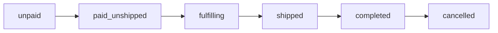

<!-- generated_from: examples/case-order-cancel-ops-faq/machine/spec.yaml -->
<!-- spec_id: SPEC-ORDER-CANCEL-002 -->
<!-- spec_version: 0.1 -->
<!-- spec_hash: 9abeffa52fe0b7432f430a20450369b6efd62014c234917f2b3a3d04fa803fb9 -->
<!-- body_hash: e15383edfa7884058c3c1ce1a563fece78bcc78912cf7ca18f614cd132ac34b3 -->
<!-- renderer_version: 4 -->
<!-- lang: zh -->
<!-- gate_mode: hard -->
<!-- 以机读 YAML 为唯一准据；禁止长期只改本文件 -->
# 电商订单 · 未发货取消（客服 FAQ 反推）

> **文档类型**：可开发的需求规格说明书（人读视图）  
> **规格 ID**：`SPEC-ORDER-CANCEL-002` · **状态**：`ready` · **版本**：`0.1`  
> **机读哈希**：`9abeffa52fe0b743…`

**EN title:** Order cancel reversed from CS FAQ

## 目录

- [1. 概览](#1-概览)
- [2. 范围](#2-范围)
- [3. 角色与权限](#3-角色与权限)
- [4. 状态与允许动作](#4-状态与允许动作)
- [5. 页面与交互](#5-页面与交互)
- [6. 主路径（编号）](#6-主路径编号)
- [7. 默认值与提示文案](#7-默认值与提示文案)
- [8. 验收标准（AC）](#8-验收标准ac)
- [9. 信息待闭合项（Pending）](#9-信息待闭合项pending)
- [10. 对象 AI](#10-对象-ai)
- [11. 原料覆盖（SourceClaim）](#11-原料覆盖sourceclaim)

## 1. 概览

从客服 FAQ 反推出的订单自助取消规格：FAQ 里「怎么答用户」的口径被还原成状态矩阵与文案原文，演示非 PRD 原料同样能收口成可开发规格。

**设计原则：**

1. FAQ 口径与规格冲突时以规格为准，FAQ 回填更新

## 2. 范围

**本期做：**

- 待支付订单买家自助取消并释放锁定优惠券
- 已支付未发货订单买家自助取消、原路退款、库存立即回库
- 履约中/已发货不可自助取消，引导客服或售后

**本期不做（白名单外，不展开）：**

- 部分取消、改地址、跨境税、订阅购、已支付取消自动回券

**对照基线：** 虚构客服知识库现行口径（与交易状态机对齐）

## 3. 角色与权限

4 类角色；可执行动作与状态矩阵联动。

| 角色 | 说明 | 可执行动作 |
|------|------|------------|
| `buyer` | 买家（下单人） | cancel_unpaid, cancel_paid_unshipped, view_refund_progress |
| `cs_agent` | 客服 | force_cancel_with_reason |
| `seller_ops` | 商家运营 | view_cancel_logs |
| `risk_engine` | 风控引擎（系统） | flag_block_self_cancel |

## 4. 状态与允许动作

6 个状态 × 1 类动作，其中明确禁止 4 项。前端显隐与置灰以下表为唯一准据。

生命周期枚举顺序（非流程图；转移条件以矩阵为准）：



**生命周期（编号供流程对照）：**
1. `unpaid`
2. `paid_unshipped`
3. `fulfilling`
4. `shipped`
5. `completed`
6. `cancelled`

| 状态 | 动作 | 是否允许 | 说明 |
|------|------|----------|------|
| `unpaid` | `buyer_self_cancel` | 允许 | 取消后关单，释放锁券，无退款单 |
| `paid_unshipped` | `buyer_self_cancel` | 允许 | 取消后原路退款+回库；不自动回券 |
| `fulfilling` | `buyer_self_cancel` | 禁止 | 按钮隐藏或置灰，文案 not_allowed |
| `shipped` | `buyer_self_cancel` | 禁止 | 引导售后 |
| `completed` | `buyer_self_cancel` | 禁止 | 无取消入口 |
| `cancelled` | `buyer_self_cancel` | 禁止 | 已取消，展示退款进度入口（若有退款单） |

## 5. 页面与交互

**入口：** 订单详情页（买家端）右下操作区；订单列表「更多」内同步暴露同一规则

### 线框

```text
┌─ 订单详情 ─────────────────────────────────────┐
│ 订单号 ORD***        状态：已支付待发货          │
│ 商品行…                                          │
│                                                  │
│  [联系客服]     [申请售后]     [取消订单]         │
└──────────────────────────────────────────────────┘
点击「取消订单」→ 确认弹窗：
┌─ 取消订单？ ─────────────────┐
│ 取消后将原路退款，库存回库。   │
│ 优惠券不自动退回。             │
│  [再想想]      [确认取消]     │
└──────────────────────────────┘
```

### 控件规格

共 5 个控件，其中 2 个定义了失败反馈文案。

| 控件 | 文案/占位 | 显示条件 | 交互 | 失败反馈 |
|------|-----------|----------|------|----------|
| btn_cancel | 取消订单 | 买家本人且状态∈{unpaid,paid_unshipped}且风控未拦截 | 打开确认弹窗 | — |
| btn_cancel_disabled | 取消订单（置灰） | 状态∈{fulfilling,shipped}（也可直接隐藏，二选一：本期=置灰+点击仍提示） | Toast 展示 not_allowed，并给出客服/售后入口 | 当前订单状态不支持自助取消，请联系客服或去售后中心 |
| dlg_confirm_title | 取消订单？ | 确认弹窗打开时 | — | — |
| dlg_confirm_ok | 确认取消 | 确认弹窗打开时 | 提交取消；成功后关弹窗并刷新详情 | 取消失败，请稍后重试（网络/支付通道异常时） |
| dlg_confirm_cancel | 再想想 | 确认弹窗打开时 | 关闭弹窗，订单不变 | — |

## 6. 主路径（编号）

共 4 步；每步的 Given/When/Then 同时是测试的验收输入。步骤为编号清单，非执行顺序。

### 步骤 1 · 取消待支付订单

- **Given：** 买家登录且为下单人；订单状态=unpaid；风控未拦截
- **When：** 点击「取消订单」并在弹窗点「确认取消」
- **Then：** 订单状态变为 cancelled；不创建退款单；已锁定优惠券释放为可再用；若有预占库存则释放
- **连带结果：**
  - 列表与详情刷新后不再显示「取消订单」

### 步骤 2 · 取消已支付未发货订单

- **Given：** 买家登录且为下单人；订单状态=paid_unshipped；风控未拦截
- **When：** 点击「取消订单」并确认
- **Then：** 订单状态变为 cancelled；创建 refund_path=original 的退款单；库存立即回库；页面展示 refund_pending 文案；优惠券不自动退回
- **连带结果：**
  - 「退款进度」入口对买家可见

### 步骤 3 · 履约中/已发货拦截

- **Given：** 订单状态=fulfilling 或 shipped
- **When：** 买家点击置灰的「取消订单」或寻找取消入口
- **Then：** 订单状态不变；展示 not_allowed；提供客服与售后入口

### 步骤 4 · 风控拦截

- **Given：** 订单被 risk_engine 标记禁止自助取消
- **When：** 买家点击「取消订单」
- **Then：** 不打开成功确认提交；展示 risk_blocked；订单状态不变

## 7. 默认值与提示文案

### 默认值

| 项 | 值 |
|----|----|
| `refund_path` | `original` |
| `refund_visible_sla_hours` | `2` |
| `inventory_release` | `immediate_on_cancel_success` |
| `coupon_release_on_unpaid_cancel` | `True` |
| `coupon_return_on_paid_cancel` | `False` |
| `confirm_dialog_required` | `True` |
| `risk_block_self_cancel` | `True` |

### 空态 / 拦截文案（须与界面一致）

| 场景 | 文案 |
|------|------|
| `not_allowed` | 当前订单状态不支持自助取消，请联系客服或去售后中心 |
| `risk_blocked` | 订单存在风险控制，暂不可自助取消 |
| `refund_pending` | 取消成功，退款处理中，预计可在 2 小时内查询到账进度 |
| `cancel_failed` | 取消失败，请稍后重试 |

## 8. 验收标准（AC）

共 5 条；逐条可执行，不可观察的表述会被门禁否决。

- **AC-01**（行为 `B1`）：Given 待支付订单 When 确认取消 Then 状态=cancelled 且无退款单且原锁定券可再次下单使用
- **AC-02**（行为 `B2`）：Given 已支付未发货且购买数量=1 When 确认取消 Then 对应 SKU 可用库存 +1 且存在原路退款单
- **AC-03**（行为 `B2`）：Given 取消成功 When 买家打开退款进度 Then 2 小时内可查询到非空进度状态（成功/处理中/失败三者之一）
- **AC-04**（行为 `B3`）：Given 履约中 When 点击取消 Then 状态仍为 fulfilling 且 Toast/文案为 not_allowed 原文
- **AC-05**（行为 `B4`）：Given 风控拦截单 When 点击取消 Then 展示 risk_blocked 原文且无退款单创建

## 9. 信息待闭合项（Pending）

无。

## 10. 对象 AI

- enabled: `False`

## 11. 原料覆盖（SourceClaim）

覆盖账本（附录）：原料每句话的下落。covered 4 · assumption 0 · out_of_scope 0 · 其他 0。

| ID | 处置 | 摘要 | 规格引用 |
|----|------|------|----------|
| `SRC-CLM-F01` | `covered` | 履约中或已发货隐藏自助取消，走售后或人工 | `B3`, `AC-04`, `btn_cancel_disabled` |
| `SRC-CLM-F02` | `covered` | 已支付未发货取消后原路退回，两小时内可在退款进度看到状态 | `B2`, `AC-02`, `AC-03`, `btn_cancel` |
| `SRC-CLM-F03` | `covered` | 待支付取消释放锁券；已支付取消不自动回券 | `B1`, `AC-01`, `dlg_confirm_title`, `dlg_confirm_ok`, `dlg_confirm_cancel` |
| `SRC-CLM-F04` | `covered` | 命中风控标签禁止自助取消 | `B4`, `AC-05` |
