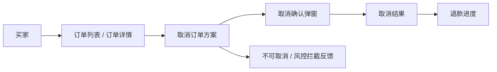
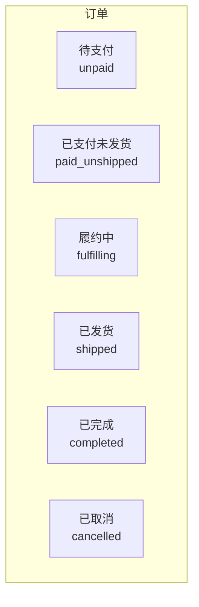

# 电商订单 · 未发货自助取消

> **文档类型**：评审就绪的标准需求规格说明书（人读评审稿）<br>
> **规格编号**：`SPEC-ORDER-CANCEL-001` · **进度**：已定稿，结构已过关，可以开会（`ready`） · **版本**：`0.1`  
> **机读哈希**：`865ba9ae8987ad49…`<br>
> **怎么读：** 先看「功能说明」判断本期方案；「主路径」用 Given/When/Then 逐条核对结果；「状态与允许动作」说明按钮何时可点；「页面与交互」说明按钮文案和失败提示。

**EN title:** Commerce order · Buyer self-cancel before shipment

## 目录

- [1. 概览](#1-概览)
- [2. 范围](#2-范围)
- [3. 功能说明](#3-功能说明)
- [4. 产品与信息架构](#4-产品与信息架构)
- [5. 职责边界](#5-职责边界)
- [6. 数据契约](#6-数据契约)
- [7. 角色与权限](#7-角色与权限)
- [8. 状态与允许动作](#8-状态与允许动作)
- [9. 页面与交互](#9-页面与交互)
- [10. 主路径（编号）](#10-主路径编号)
- [11. 默认值与提示文案](#11-默认值与提示文案)
- [12. 错误码](#12-错误码)
- [13. 验收标准（AC）](#13-验收标准ac)
- [14. 信息待闭合项（Pending）](#14-信息待闭合项pending)
- [15. 决策记录](#15-决策记录)
- [16. 对象 AI](#16-对象-ai)
- [17. 原料落在规格里的情况](#17-原料落在规格里的情况)

## 1. 概览

买家在订单详情页自助取消订单：待支付直接关单释券；已支付未发货原路退款回库；履约中与风控命中一律拦截并给出原文文案。本规格覆盖取消入口的显隐、确认弹窗、四条状态分支与退款可查性。

**设计原则：**

1. 状态×动作矩阵是唯一准据；前端显隐置灰不得自行发明规则
2. 拦截与失败文案原文入库，界面逐字使用，不得二次创作
3. 退款异步执行，但两小时内必须可查到进度

**环境与约束：**

- 本期不接人工客服链路；拦截场景仅提示文案引导
- 优惠券释放依赖营销服务回调，超时按未释放告警处理

## 2. 范围

**本期做：**

- 待支付订单买家自助取消并释放锁定优惠券
- 已支付未发货订单买家自助取消、原路退款、库存立即回库
- 履约中/已发货不可自助取消，引导客服或售后

**本期不做（白名单外，不展开）：**

- 部分取消、改地址、跨境税、订阅购、已支付取消自动回券

**对照基线：** 虚构自营商城 App 现网交易链路（不含跨境与订阅购）

## 3. 功能说明

本章列出本期要做的功能。每条的验收写法（Given/When/Then）见后面「主路径」同编号步骤。

### 1. 取消待支付订单

**要做到：** 订单状态变为 已取消（`cancelled`）；不创建退款单；已锁定优惠券释放为可再用；若有预占库存则释放
**对应：** 步骤 1 · `B1`

### 2. 取消已支付未发货订单

**要做到：** 订单状态变为 已取消（`cancelled`）；创建 refund_path=original 的退款单；库存立即回库；页面展示 「取消成功，退款处理中，预计可在 2 小时内查询到账进度」 文案；优惠券不自动退回
**对应：** 步骤 2 · `B2`

### 3. 履约中/已发货拦截

**要做到：** 订单状态不变；展示 「当前订单状态不支持自助取消，请联系客服或去售后中心」；提供客服与售后入口
**对应：** 步骤 3 · `B3`

### 4. 风控拦截

**要做到：** 不打开成功确认提交；展示 「订单存在风险控制，暂不可自助取消」；订单状态不变
**对应：** 步骤 4 · `B4`

## 4. 产品与信息架构

买家从订单入口进入详情，在取消方案中完成确认、查看拦截反馈或取消结果；退款进度属于成功结果的后续信息。



## 5. 职责边界

本章按模块划分方案边界。每个模块先写中文名称；括号里的机读 ID 给助手和检查工具对账，不是菜单原文。「负责」是该模块包含的界面或能力，「不负责」是明确不做的事。

### 订单入口

这是**模块**（机读 ID：`order_entry`）。

| 负责 | 不负责 |
|------|--------|
| 在列表和详情按同一规则展示取消入口 | 售后申请与人工客服处理流程 |
| 展示当前订单状态与可执行动作 | — |

### 取消流程

这是**模块**（机读 ID：`cancel_flow`）。

| 负责 | 不负责 |
|------|--------|
| 确认弹窗、状态分支与取消结果 | 已发货订单的逆向售后流程 |
| 待支付释券、已支付退款回库的产品规则 | — |

### 结果与反馈

这是**模块**（机读 ID：`result_feedback`）。

| 负责 | 不负责 |
|------|--------|
| 展示拦截、失败和退款处理中原文文案 | 支付通道、库存或风控的内部实现 |
| 在两小时内提供可查询的退款进度 | — |

## 6. 数据契约

共 2 个数据实体。每个对象一张字段表，用于评审时对齐业务含义、输入输出和关键规则；不在这里规定开发语言或测试方案。

### CancelRequest · 取消意图

| 字段 | 中文 | 类型 | 说明 |
|------|------|------|------|
| `order_id` | 订单号 | `string` | 待取消订单 |
| `buyer_id` | 买家标识 | `string` | 必须与订单归属一致，否则拒绝 |
| `reason_code` | 取消原因码 | `string` | 枚举见运营配置；可空 |

**规则：**

- 是否允许取消以状态×动作矩阵为唯一产品规则
- 同一订单重复确认不得产生多个取消结果或多笔退款

### CancelResult · 取消结果

| 字段 | 中文 | 类型 | 说明 |
|------|------|------|------|
| `status` | 结果状态 | `enum` | 已关闭 / 退款处理中 / 已拒绝 |
| `refund_eta_hours` | 退款可查时限 | `number` | 已支付场景固定 2 |
| `message_key` | 文案键 | `string` | 指向 empty_states 键名，界面逐字展示 |

**规则：**

- 已拒绝时 message_key 必填且必须命中已定义的用户文案

## 7. 角色与权限

下面是**登录身份**（谁在操作系统），不是页面名称。可执行动作是业务动作（和下一章「动作」列对应），不是接口路径，也不是数据库字段。

| 身份 | 机读 ID | 可执行动作 |
|------|---------|------------|
| 买家（下单人） | `buyer` | 买家自助取消（`buyer_self_cancel`） |
| 客服 | `cs_agent` | — |
| 商家运营 | `seller_ops` | — |
| 风控引擎（系统） | `risk_engine` | — |

## 8. 状态与允许动作

本章回答两件事：①现在处于哪个状态（哪个页面/哪条任务）；②该状态下哪些动作允许、哪些禁止。下图按对象分组，方框之间没有箭头——允许的转移只看下面的表，不从图上猜。

共 6 个状态、1 类动作，其中明确禁止 4 项。前端按钮显隐与置灰以下表为唯一准据。

已声明的状态集合（不表示转移；允许的转移以下表为准）：



**按对象列出的状态（编号只为对照，不是流转顺序）：**

### 订单

1. 待支付（`unpaid`）
2. 已支付未发货（`paid_unshipped`）
3. 履约中（`fulfilling`）
4. 已发货（`shipped`）
5. 已完成（`completed`）
6. 已取消（`cancelled`）

| 状态 | 动作 | 是否允许 | 说明 |
|------|------|----------|------|
| 订单 · 待支付（`unpaid`） | 买家自助取消（`buyer_self_cancel`） | 允许 | 取消后关单，释放锁券，无退款单 |
| 订单 · 已支付未发货（`paid_unshipped`） | 买家自助取消（`buyer_self_cancel`） | 允许 | 取消后原路退款+回库；不自动回券 |
| 订单 · 履约中（`fulfilling`） | 买家自助取消（`buyer_self_cancel`） | 禁止 | 按钮隐藏或置灰，文案 「当前订单状态不支持自助取消，请联系客服或去售后中心」 |
| 订单 · 已发货（`shipped`） | 买家自助取消（`buyer_self_cancel`） | 禁止 | 引导售后 |
| 订单 · 已完成（`completed`） | 买家自助取消（`buyer_self_cancel`） | 禁止 | 无取消入口 |
| 订单 · 已取消（`cancelled`） | 买家自助取消（`buyer_self_cancel`） | 禁止 | 已取消，展示退款进度入口（若有退款单） |

## 9. 页面与交互

本章是页面上用户能点到的按钮和输入框。按钮文案是界面上的字；机读 ID 给规格与原型对账。

**入口：** 订单详情页（买家端）右下操作区；订单列表「更多」内同步暴露同一规则

### 线框

```text
┌─ 订单详情 ─────────────────────────────────────┐
│ 订单号 ORD***        状态：已支付待发货          │
│ 商品行…                                          │
│                                                  │
│  [联系客服]     [申请售后]     [取消订单]         │
└──────────────────────────────────────────────────┘
点击「取消订单」→ 确认弹窗：
┌─ 取消订单？ ─────────────────┐
│ 取消后将原路退款，库存回库。   │
│ 优惠券不自动退回。             │
│  [再想想]      [确认取消]     │
└──────────────────────────────┘
```

### 控件规格

共 5 个控件，其中 2 个定义了失败反馈文案。

| 按钮文案 | 机读 ID | 显示条件 | 交互 | 失败反馈 |
|----------|---------|----------|------|----------|
| 取消订单 | `btn_cancel` | 买家本人且状态∈{待支付（`unpaid`）,已支付未发货（`paid_unshipped`）}且风控未拦截 | 打开确认弹窗 | — |
| 取消订单（置灰） | `btn_cancel_disabled` | 状态∈{履约中（`fulfilling`）,已发货（`shipped`）}（也可直接隐藏，二选一：本期=置灰+点击仍提示） | Toast 展示 「当前订单状态不支持自助取消，请联系客服或去售后中心」，并给出客服/售后入口 | 当前订单状态不支持自助取消，请联系客服或去售后中心 |
| 取消订单？ | `dlg_confirm_title` | 确认弹窗打开时 | — | — |
| 确认取消 | `dlg_confirm_ok` | 确认弹窗打开时 | 提交取消；成功后关弹窗并刷新详情 | 取消失败，请稍后重试（网络/支付通道异常时） |
| 再想想 | `dlg_confirm_cancel` | 确认弹窗打开时 | 关闭弹窗，订单不变 | — |

## 10. 主路径（编号）

共 4 步。这是「功能说明」的可观察结果写法，供评审逐条核对；编号不是用户操作顺序。

### 步骤 1 · 取消待支付订单

- **Given：** 买家登录且为下单人；订单状态=待支付（`unpaid`）；风控未拦截
- **When：** 点击「取消订单」并在弹窗点「确认取消」
- **Then：** 订单状态变为 已取消（`cancelled`）；不创建退款单；已锁定优惠券释放为可再用；若有预占库存则释放
- **连带结果：**
  - 列表与详情刷新后不再显示「取消订单」

### 步骤 2 · 取消已支付未发货订单

- **Given：** 买家登录且为下单人；订单状态=已支付未发货（`paid_unshipped`）；风控未拦截
- **When：** 点击「取消订单」并确认
- **Then：** 订单状态变为 已取消（`cancelled`）；创建 refund_path=original 的退款单；库存立即回库；页面展示 「取消成功，退款处理中，预计可在 2 小时内查询到账进度」 文案；优惠券不自动退回
- **连带结果：**
  - 「退款进度」入口对买家可见

### 步骤 3 · 履约中/已发货拦截

- **Given：** 订单状态=履约中（`fulfilling`） 或 已发货（`shipped`）
- **When：** 买家点击置灰的「取消订单」或寻找取消入口
- **Then：** 订单状态不变；展示 「当前订单状态不支持自助取消，请联系客服或去售后中心」；提供客服与售后入口

### 步骤 4 · 风控拦截

- **Given：** 订单被 风控引擎（系统）（`risk_engine`） 标记禁止自助取消
- **When：** 买家点击「取消订单」
- **Then：** 不打开成功确认提交；展示 「订单存在风险控制，暂不可自助取消」；订单状态不变

## 11. 默认值与提示文案

### 默认值

| 项 | 值 |
|----|----|
| `refund_path` | `original` |
| `refund_visible_sla_hours` | `2` |
| `inventory_release` | `immediate_on_cancel_success` |
| `coupon_release_on_unpaid_cancel` | 是 |
| `coupon_return_on_paid_cancel` | 否 |
| `confirm_dialog_required` | 是 |
| `risk_block_self_cancel` | 是 |

### 空态 / 拦截文案（须与界面一致）

| 场景 | 文案 |
|------|------|
| `not_allowed` | 当前订单状态不支持自助取消，请联系客服或去售后中心 |
| `risk_blocked` | 订单存在风险控制，暂不可自助取消 |
| `refund_pending` | 取消成功，退款处理中，预计可在 2 小时内查询到账进度 |
| `cancel_failed` | 取消失败，请稍后重试 |

## 12. 错误码

评审时用一张表统一错误含义、触发条件、是否可重试和用户看到的文案。

| 错误码 | 含义 | 触发场景 | 可重试 | 用户文案 |
|--------|------|----------|--------|----------|
| `CANCEL_NOT_ALLOWED` | 当前状态不可自助取消 | 状态 ∈ {履约中（`fulfilling`）, 已发货（`shipped`）} 时提交取消 | 否 | 当前订单状态不支持自助取消，请联系客服或去售后中心 |
| `RISK_BLOCKED` | 风控拦截 | 风控服务返回命中 | 否 | 订单存在风险控制，暂不可自助取消 |
| `CANCEL_FAILED` | 取消执行失败 | 支付通道或网络异常 | 是 | 取消失败，请稍后重试 |

## 13. 验收标准（AC）

共 5 条；逐条可执行，已知空话／占位词会被门禁否决。

- **AC-01**（行为 `B1`）：Given 待支付订单 When 确认取消 Then 状态=已取消（`cancelled`） 且无退款单且原锁定券可再次下单使用
- **AC-02**（行为 `B2`）：Given 已支付未发货且购买数量=1 When 确认取消 Then 对应 SKU 可用库存 +1 且存在原路退款单
- **AC-03**（行为 `B2`）：Given 取消成功 When 买家打开退款进度 Then 2 小时内可查询到非空进度状态（成功/处理中/失败三者之一）
- **AC-04**（行为 `B3`）：Given 履约中 When 点击取消 Then 状态仍为 履约中（`fulfilling`） 且 Toast/文案为 「当前订单状态不支持自助取消，请联系客服或去售后中心」 原文
- **AC-05**（行为 `B4`）：Given 风控拦截单 When 点击取消 Then 展示 「订单存在风险控制，暂不可自助取消」 原文且无退款单创建

## 14. 信息待闭合项（Pending）

无。

## 15. 决策记录

共 3 项，已拍板 3 项，待定 0 项。「为什么是这样」的存档，新人不必考古聊天记录。

| ID | 问题 | 选定 | 日期 | 备注 |
|----|------|------|------|------|
| D-01 | 已支付订单取消后，锁定的优惠券是否自动回券？ | 不自动回券，走客服申诉 (`B`) | 2026-08-07 | 原料只写了待支付释券，未规定已支付取消是否回券；本期按不自动回券处理，属产品补全，不是原料原文。 |
| D-02 | 履约中订单是否开放自助取消？ | 不开放，仅文案引导联系客服 (`B`) | 2026-08-07 | 履约成本与逆向物流复杂度高，本期锁死 |
| D-PROTOTYPE | 本次需求评审是否需要可交互原型？如需要，采用什么载体？ | 静态 HTML，可直接打开 (`static_html`) | 2026-08-24 | 本样例需在评审中演示入口显隐、确认弹窗和拦截反馈，采用仓库内静态 HTML。 |

## 16. 对象 AI

- enabled: `False`

## 17. 原料落在规格里的情况

下面逐条对照原始需求说明。处理结果用中文；括号里的编号给助手和检查工具对账。已写入规格 6 条 · 原文没写、规格补了猜测 2 条 · 本期不做 1 条 · 其他 0 条。完整性需要开会时抽查。

| 原料条目编号 | 处理结果 | 这条在说什么 | 落到说明书的哪一段 |
|--------------|----------|--------------|--------------------|
| `SRC-CLM-001` | 已写入规格 | 待支付订单取消后应关闭，并释放优惠券（若已锁定） | 功能「取消待支付订单」（`B1`）；验收句「Given 待支付订单 When 确认取消 Then 状态=cancelled 且无退款单且原锁定券可再次下单使用」（`AC-01`）；页面控件「取消订单」（`btn_cancel`）；页面控件「取消订单？」（`dlg_confirm_title`）；页面控件「确认取消」（`dlg_confirm_ok`）；页面控件「再想想」（`dlg_confirm_cancel`） |
| `SRC-CLM-002` | 已写入规格 | 已支付未发货取消后须原路退款、库存回库，2小时内退款状态可查 | 功能「取消已支付未发货订单」（`B2`）；验收句「Given 已支付未发货且购买数量=1 When 确认取消 Then 对应 SKU 可用库存 +1 且存在原路退款单」（`AC-02`）；验收句「Given 取消成功 When 买家打开退款进度 Then 2 小时内可查询到非空进度状态（成功/处理中/失败三者之一）」（`AC-03`）；页面控件「取消订单」（`btn_cancel`） |
| `SRC-CLM-003` | 已写入规格 | 履约中买家不可自助取消，只能联系客服 | 功能「履约中/已发货拦截」（`B3`）；验收句「Given 履约中 When 点击取消 Then 状态仍为 fulfilling 且 Toast/文案为 not_allowed 原文」（`AC-04`）；页面控件「取消订单（置灰）」（`btn_cancel_disabled`） |
| `SRC-CLM-004` | 已写入规格 | 风控命中订单禁止自助取消 | 功能「风控拦截」（`B4`）；验收句「Given 风控拦截单 When 点击取消 Then 展示 risk_blocked 原文且无退款单创建」（`AC-05`） |
| `SRC-CLM-005` | 本期不做 | 部分取消、改地址、跨境税、订阅购不在本期 | 本期不做，不落到说明书具体条目 |
| `SRC-CLM-006` | 已写入规格 | 背景与痛点：日单量约 8 万；客服被「点错想取消」工单淹没；库存被无效占用 | 功能「取消待支付订单」（`B1`）；功能「取消已支付未发货订单」（`B2`） |
| `SRC-CLM-007` | 已写入规格 | 已发货走售后，不在本期 | 功能「履约中/已发货拦截」（`B3`）；已拍板事项「履约中订单是否开放自助取消？」（`D-02`） |
| `SRC-CLM-008` | 原文没写、规格补了猜测 | 已支付取消后优惠券不自动退回（原料只写待支付释券，已支付回券未规定） | 已拍板事项「已支付订单取消后，锁定的优惠券是否自动回券？」（`D-01`）；功能「取消已支付未发货订单」（`B2`） |
| `SRC-CLM-009` | 原文没写、规格补了猜测 | 确认弹窗、双入口、置灰而非隐藏、登录且为下单人——原料未写，产品为评审补全 | 页面控件「取消订单」（`btn_cancel`）；页面控件「取消订单？」（`dlg_confirm_title`）；页面控件「确认取消」（`dlg_confirm_ok`）；页面控件「再想想」（`dlg_confirm_cancel`） |

<!-- generated_from: examples/case-order-cancel-raw/machine/spec.yaml -->
<!-- spec_id: SPEC-ORDER-CANCEL-001 -->
<!-- spec_version: 0.1 -->
<!-- spec_hash: 865ba9ae8987ad491eccc51ea8164f93825d3fa03e4cbe2d1a2604727329a9d0 -->
<!-- body_hash: 63b858cda89ec0c9a5a59bf983c2a4021fdeb4dc3878a604ea1f5aaf8fbb4300 -->
<!-- renderer_version: 14 -->
<!-- lang: zh -->
<!-- gate_mode: hard -->
<!-- 以机读 YAML 为唯一准据；禁止长期只改本文件 -->
